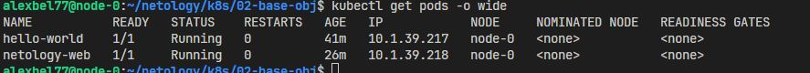
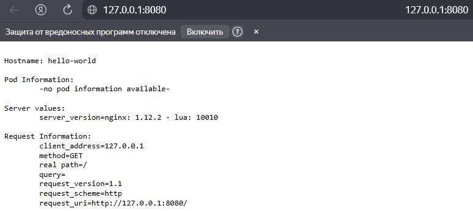
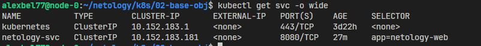

# Базовые объекты K8S

### Задание 1

1. Манифест pod hello-world - [hello-world-pod.yml]()

    <center>
    
    </center>

2. Проброс портов: 

    ```bash
    kubectl port-forward pods/hello-world 8080:8080
    ```

    <center>
    
    </center>

### Задание 2

1. Манифест pod netology-web - [netology-web-pod.yml]()

2. Манифест service netology-svc - [netology-svc.yml]()

    <center>
    
    </center>

2. Проброс портов: 

    ```bash
    kubectl port-forward services/netology-svc 8080:8080
    ```

    <center>
    
    </center>