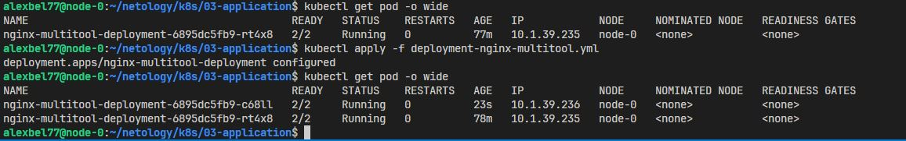
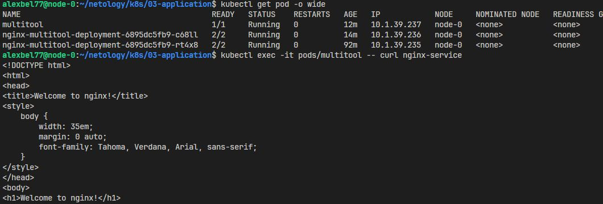
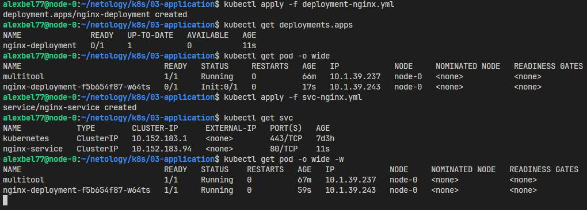

# Запуск приложений в K8S

### Задание 1

- Манифест Deployment - [deployment-nginx-multitool.yml](https://github.com/alex-bel31/k8s/blob/main/03-application/deployment-nginx-multitool.yml)

    <center>
    
    </center>

- Манифест Service - [svc-nginx.yml](https://github.com/alex-bel31/k8s/blob/main/03-application/svc-nginx.yml)

    ```bash
    kubectl run multitool --image=wbitt/network-multitool
    ```

    <center>
    
    </center>

### Задание 2

- Манифест Deployment - [deployment-nginx.yml](https://github.com/alex-bel31/k8s/blob/main/03-application/deployment-nginx.yml)

    <center>
    
    </center>