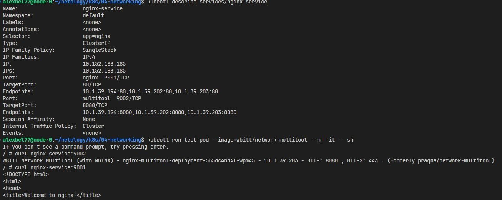
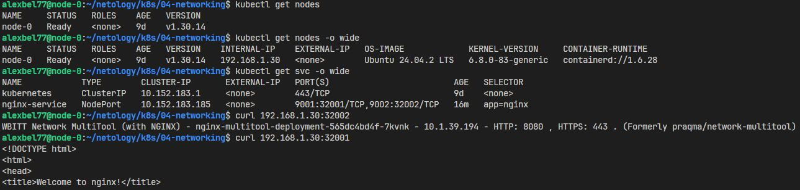
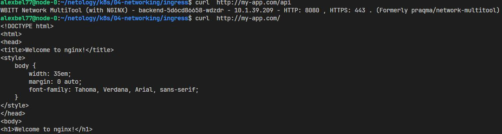

# Сетевое взаимодействие в Kubernetes

### Задание 1: Настройка Service (ClusterIP и NodePort)

1. Манифест Deployment с двумя контейнерами - [deployment-nginx-multitool.yml](https://github.com/alex-bel31/k8s/blob/main/04-networking/services/deployment-nginx-multitool.yml) :
    - nginx (порт 80)
    - multitool (порт 8080)
    - Количество реплик: 3
2. Манифест Service типа ClusterIP - [svc-nginx.yml](https://github.com/alex-bel31/k8s/blob/main/04-networking/services/svc-nginx.yml) :
    - Открывает nginx на порту 9001.
    - Открывает multitool на порту 9002.

    Проверка доступность изнутри кластера:

    ```bash
    kubectl run test-pod --image=wbitt/network-multitool --rm -it -- sh
    ``` 
    <center>
    
    </center>

3. Манифест Service типа NodePort для доступа к nginx снаружи - [svc-nginx-nd.yml](https://github.com/alex-bel31/k8s/blob/main/04-networking/services/svc-nginx-nd.yml)

    Проверка доступности вне кластера:

    <center>
    
    </center>
---

### Задание 2: Настройка Ingress


1. Deployment frontend и backend:
    - [frontend](https://github.com/alex-bel31/k8s/blob/main/04-networking/ingress/deployment-frontend.yml) (образ nginx).
    - [backend](https://github.com/alex-bel31/k8s/blob/main/04-networking/ingress/deployment-backend.yml) (образ wbitt/network-multitool).

2. Манифесты сервисов для каждого приложения:
    - [Service fronend](https://github.com/alex-bel31/k8s/blob/main/04-networking/ingress/service-frontend.yml)
    - [Service backend](https://github.com/alex-bel31/k8s/blob/main/04-networking/ingress/service-backendyml)

3. Манифест Ingress - [ingress.yml](https://github.com/alex-bel31/k8s/blob/main/04-networking/ingress/ingress.yml)
    - Открывает frontend по пути /.
    - Открывает backend по пути /api.

    Проверка доступности:

    <center>
    
    </center>
