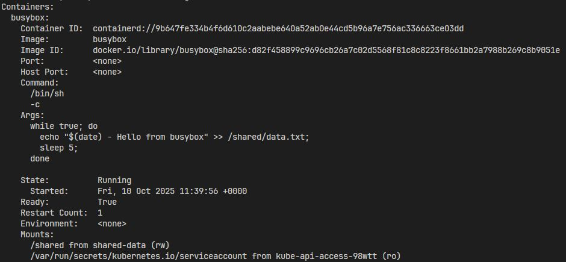
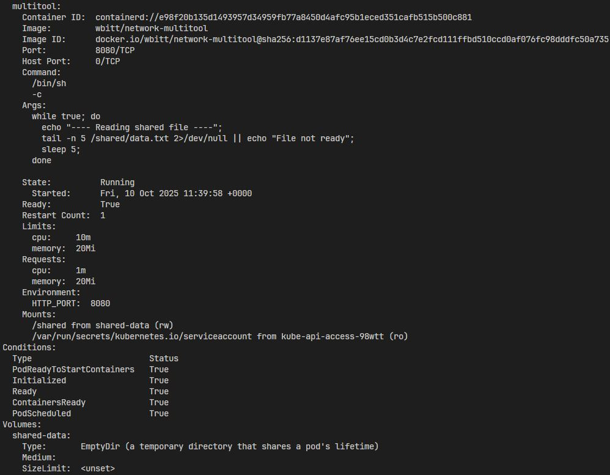
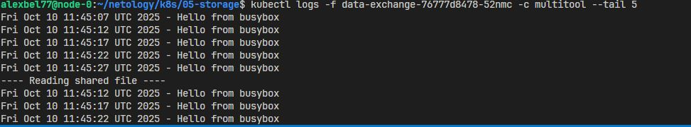
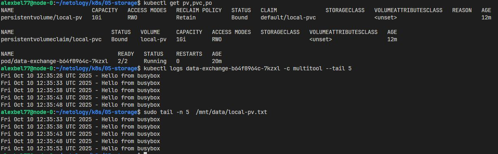
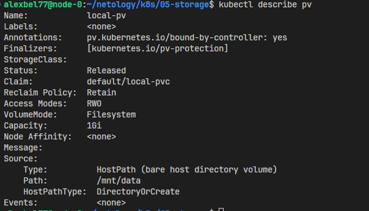
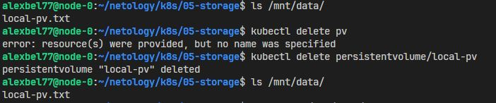
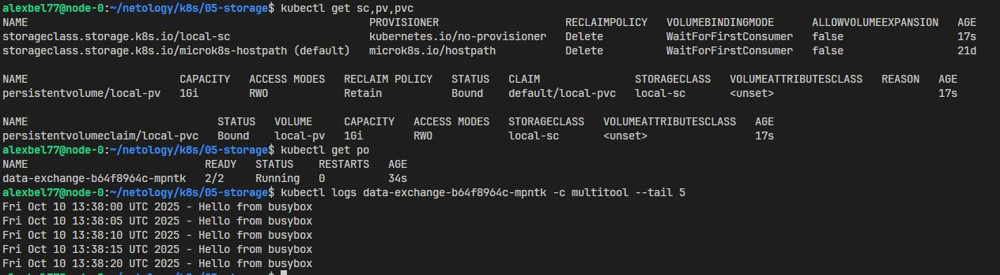

# Хранение в K8s

### Задание 1. Volume: обмен данными между контейнерами в поде

* Манифест - [containers-data-exchange.yml
](https://github.com/alex-bel31/k8s/blob/main/05-storage/containers-data-exchange.yml)

    

    
    

    

    
    

    

    
    

### Задание 2. PV, PVC

1. Манифест - [pv-pvc.yml
](https://github.com/alex-bel31/k8s/blob/main/05-storage/pv-pvc.yml)

    

    
    

2. PV останется, но перейдёт в статус Released, но его нельзя будет перепривязать к новому PVC, пока существует старая привязка. Данные в /mnt/data сохраняются, так как выбранная ReclaimPolicy - Retain.

    

    
    

3. Директория /mnt/data не удалилась, потому что hostPath — это ссылка на локальный путь, и k8s не управляет ее жизненным циклом. Удаление PV не трогает файловую систему узла.

    

    
    

### Задание 3. StorageClass

1. Манифест - [sc.yml
](https://github.com/alex-bel31/k8s/blob/main/05-storage/sc.yml)

    

    
    
