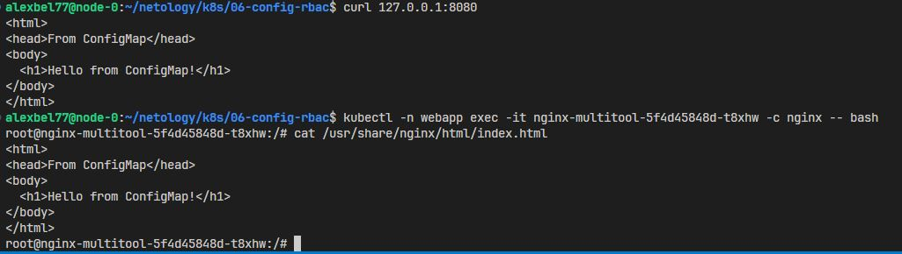
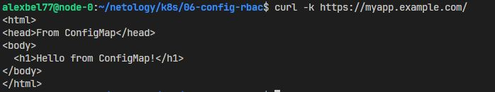
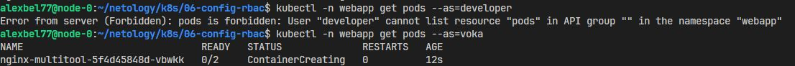

# Настройка приложений и управление доступом в Kubernetes

### Задание 1: Работа с ConfigMaps

1. Манифест Deployment с ingnx и multitool - [deployment.yml
](https://github.com/alex-bel31/k8s/blob/main/06-config-rbac/deployment.yml)

2. Манифест ConfigMap - [configmap-web.yml
](https://github.com/alex-bel31/k8s/blob/main/06-config-rbac/configmap-web.yml)

3. Проверка доступности:
    <center>
    
    </center>

### Задание 2: Настройка HTTPS с Secrets

1. Манифест Ingress - [ingress-tls.yml
](https://github.com/alex-bel31/k8s/blob/main/06-config-rbac/ingress-tls.yml)

2. Генерация сертификата и создание Secret

```bash
openssl req -x509 -nodes -days 365 -newkey rsa:2048 \
  -keyout tls.key -out tls.crt -subj "/CN=myapp.example.com"

kubectl create secret tls myapp-tls --cert=tls.crt --key=tls.key -n webapp
```
3. Проверка доступности:

    <center>
    
    </center>

### Задание 3: Настройка RBAC

1. Манифест Role - [role-pod-reader.yml
](https://github.com/alex-bel31/k8s/blob/main/06-config-rbac/role-pod-reader.yml)

2. Манифест RoleBinding - [rolebinding-developer.yml
](https://github.com/alex-bel31/k8s/blob/main/06-config-rbac/rolebinding-developer.yml)

3. Проверка прав:
    <center>
    
    </center>
