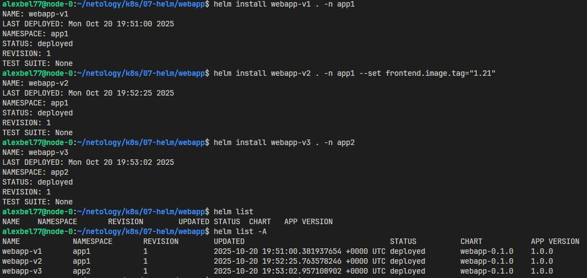
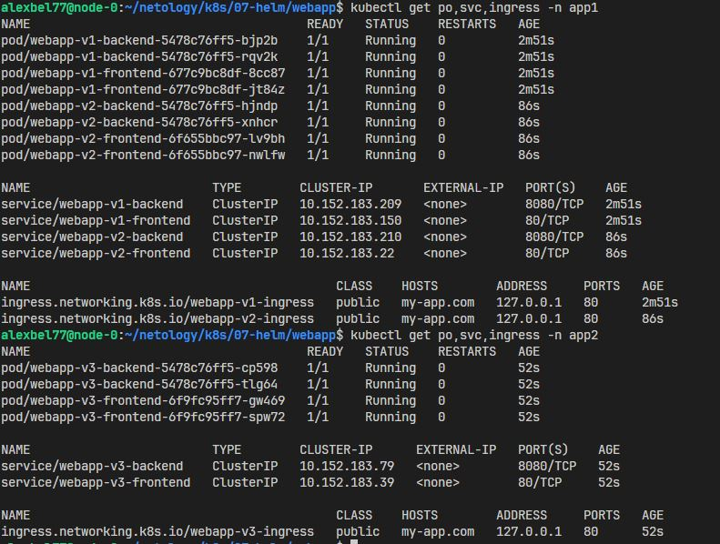

# Helm 
## Задание 1. Подготовить Helm-чарт для приложения

Helm-чарт [`webapp`](https://github.com/alex-bel31/k8s/blob/main/07-helm/webapp) разворачивает веб-приложение: 

* **frontend** — Nginx (порт 80)
* **backend** — Multitool (порт 8080)

 Основные параметры (`values.yaml`)

| Параметр                    | Назначение                           | Значение по умолчанию     |
| --------------------------- | ------------------------------------ | ------------------------- |
| `namespace`                 | Namespace, куда устанавливается чарт | `webapp`                  |
| `frontend.image.repository` | Образ для фронтенда                  | `nginx`                   |
| `frontend.image.tag`        | Тег образа                           | `1.14.2`                  |
| `frontend.replicas`         | Количество подов frontend            | `2`                       |
| `frontend.port`             | Порт фронтенда                       | `80`                      |
| `backend.image.repository`  | Образ для backend                    | `wbitt/network-multitool` |
| `backend.image.tag`         | Тег образа                           | `latest`                  |
| `backend.replicas`          | Количество подов backend             | `2`                       |
| `backend.port`              | Порт backend                         | `8080`                    |

* Имена ресурсов шаблонизированы через `.Release.Name`, что позволяет устанавливать несколько версий чарта параллельно.

## Задание 2. Запустить две версии в разных неймспейсах

1. Команды для деплоя:
    ```bash
    kubectl create ns app1 app2

    helm install webapp-v1 . -n app1
    helm install webapp-v2 . -n app1 --set frontend.image.tag="1.21"
    helm install webapp-v3 . -n app2
    ```

2. Результат деплоя: 

    <center>
    
    </center>

    <center>
    
    </center>


