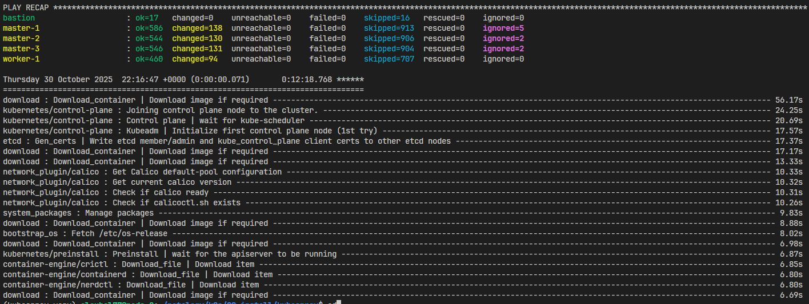
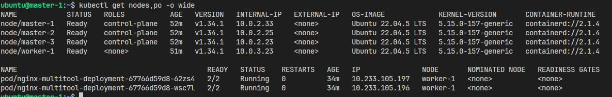

# Установка Kubernetes


## Инфраструктура Kubernetes в Yandex Cloud

1. **Сетевые ресурсы**

   * Создан VPC (`yandex_vpc_network`) и NAT-шлюз (`yandex_vpc_gateway`).
   * Созданы подсети.
   * Настроены таблицы маршрутизации для приватных подсетей через NAT.

2. **Группы безопасности**

   * `sg_bastion` — разрешает SSH с внешнего IP.
   * `sg_nodes` — разрешает:

     * SSH с bastion,
     * Kubernetes API (6443),
     * etcd (2379/2380),
     * node-to-node коммуникацию (10250–65535).

3. **Виртуальные машины**

   * Bastion с публичным IP для доступа к закрытой сети.
   * 3 мастера (`k8s_master`) без публичного IP, с 2 vCPU и 4 GB RAM.
   * 1 воркер (`k8s_worker`) без публичного IP, с 2 vCPU и 2 GB RAM.
   * ВМ инициализируются через **cloud-init**.

4. **Ansible инвентарь**

   * `inventory.ini` генерируется через `local_file` с внутренними IP мастеров, воркеров и bastion.

5. **Развертывание Kubernetes**

   * Kubespray устанавливает HA кластер с 3 мастерами и 1 воркером.
   * CNI — Calico.
   * CRI — containerd

    ```bash
    git clone https://github.com/kubernetes-sigs/kubespray

    python3 -m venv kubespray-venv
    source kubespray-venv/bin/activate

    pip install -r requirements.txt
    sudo cp -rfp inventory/sample inventory/mycluster

    ansible-playbook -i inventory/mycluster/inventory.ini -b -v cluster.yml 
    ```

    <center>
    
    </center>

    <center>
    
    </center>    
