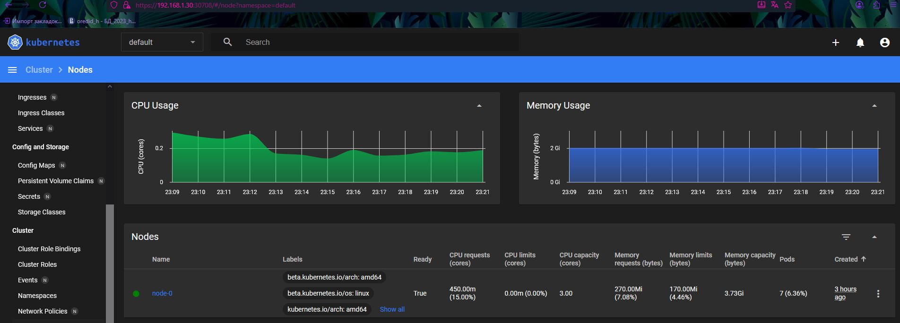
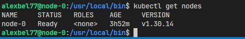

# Kubernetes. Причины появления. Команда kubectl

- Установка MicroK8s

    ```bash
    sudo snap install microk8s --classic --channel=1.30/stable

    sudo usermod -aG microk8s $USER
    newgrp microk8s

    microk8s status --wait-ready
    ```

- Установка kubectl локально

    ```bash
    curl -LO "https://storage.googleapis.com/kubernetes-release/release/$(curl -s https://storage.googleapis.com/kubernetes-release/release/stable.txt)/bin/linux/amd64/kubectl"
    chmod +x kubectl
    sudo mv kubectl /usr/local/bin/
    ```

- Настройка kubeconfig MicroK8s:

    ```bash
    microk8s config > ~/.kube/config
    export KUBECONFIG=~/.kube/config
    ```

- Включение Dashboard и дополнительных аддонов

    ```bash
    microk8s enable dashboard dns metrics
    ```

- Проверка подов

    ```bash
    microk8s kubectl get pods -n kube-system -o wide
    ```


- Некоторые образы пришлось дополнительно подтянуть:

    ```bash
    sudo microk8s ctr images pull docker.io/calico/kube-controllers:v3.25.1
    sudo microk8s ctr images pull docker.io/calico/node:v3.25.1
    sudo microk8s ctr images pull docker.io/kubernetesui/dashboard:v2.7.0
    ```

- Настройка сертификатов 

    1. Отредактирован шаблон `csr.conf.template` → добавлен внешний IP.
    2. Обновлены сертификаты:

        ```bash
        sudo microk8s refresh-certs --cert server.сrt
        ```

- Доступ к Dashboard напрямую по IP VM через NodePort

    ```bash
    microk8s kubectl -n kube-system patch service kubernetes-dashboard -p '{"spec":{"type":"NodePort"}}'
    microk8s kubectl -n kube-system get service kubernetes-dashboard
    ```

- Получение токена для входа

    ```bash
    microk8s kubectl -n kube-system get secret
    microk8s kubectl -n kube-system describe secret microk8s-dashboard-token
    ```

    <center>
    
    </center>

    <center>
    
    </center>
